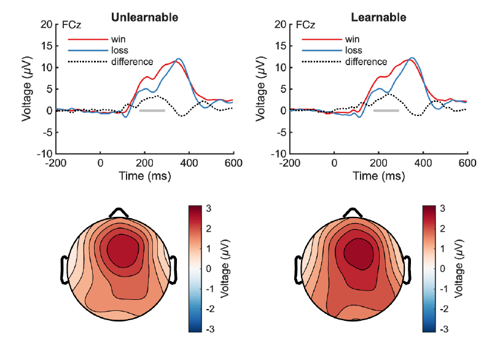
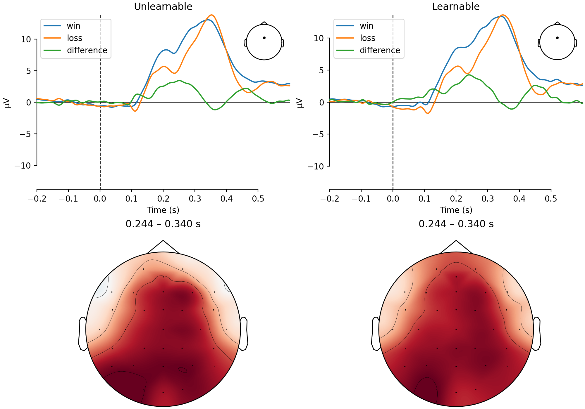
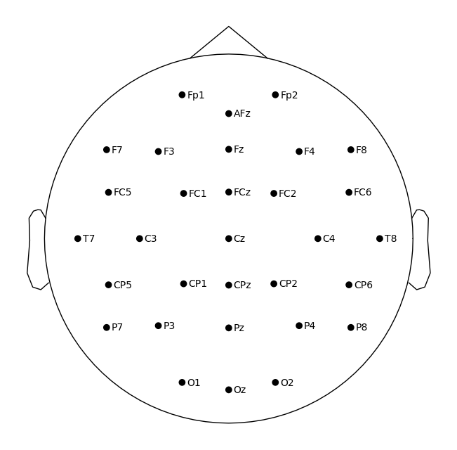

# Analiza danych EEG 'different doors'

## Setup

``` shell
git clone "https://github.com/mutt00/projekt-dane-eeg.git" && cd projekt-dane-eeg/

datalad clone "https://github.com/OpenNeuroDatasets/ds007647.git" data
datalad get data/sub-*
```

- `main.py` runs the pipeline for all subjects.
- `sub-01.ipynb` contains the same pipeline for `sub-01`.

## Results


- RewP (Oloriz & Hassall, 2026)



- RewP (reproduction)



- Sensors (reproduction [`montage = easycap-M1`])

## Analysis (per article)
- Evoked responses for two conditions: learnable vs unlearnable task
- RewP amplitude 240ms-340ms

## Processing (per article)
- Band-pass 0.1 Hz – 30 Hz
- downsample to 250 Hz
- Reference at Fz, re-reference from M1/M2, drop M1/M2
- set montage as `easycap-M1` ("brainvision 32-electrode")
- calculate data rank
- mark bad PTP amplitude
- ICA (infomax), ICLabel
- Events, epochs from annotations
- Subject exclusion based on noise/bad epochs

## Bibliografia
- Badanie:
  - The Effects of Learnability and Reward Responsiveness on Reward Processing [https://www.biorxiv.org/content/10.64898/2026.04.13.718323v1]
- Dane:
  - OpenNeuro [https://openneuro.org/datasets/ds007647/]
  - GIT [https://github.com/OpenNeuroDatasets/ds007647.git]
- Analiza Danych:
  - EEG is better left alone [https://doi.org/10.1038/s41598-023-27528-0]
  - EEG is better left alone, but ERPs must be attended to [https://doi.org/10.1016/j.ijpsycho.2024.112441]
